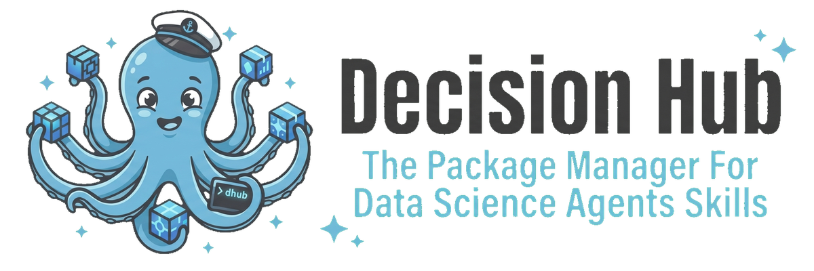

<p align="center">
  
</p>

**Decision Hub** is a registry for publishing, discovering, and installing *Skills* — modular packages of code and prompts that AI coding agents (Claude, Cursor, Codex, Gemini, OpenCode) can use. Publish a skill once, install it into any supported agent with one command.

**Browse the registry at [hub.decision.ai](https://hub.decision.ai)** or use the CLI below.

## Installation

```bash
curl -LsSf https://astral.sh/uv/install.sh | sh && PATH="$HOME/.local/bin:$PATH" uv tool install dhub-cli
```

This installs [uv](https://docs.astral.sh/uv/) (if not already present), updates your `PATH`, and installs the CLI. If you already have `uv` or `pipx`:

```bash
uv tool install dhub-cli    # via uv
pipx install dhub-cli       # via pipx
```

## Quick Start

```bash
# Search for skills in plain English
dhub ask "I need to do Bayesian statistics with PyMC"

# Install to Claude, Cursor, Codex, Gemini, OpenCode...
dhub install pymc-labs/pymc-modeling

# Scaffold and publish your own skill
dhub init my-skill
dhub publish ./my-skill
```

## Why Decision Hub

**Agents that extend themselves.** Decision Hub ships as a skill itself. Install it into Claude Code (or any supported agent), and the agent can discover new skills mid-conversation — `dhub ask "analyze A/B test results"` — then install and use them without human intervention.

**Publish from anywhere.** Point `dhub publish` at a local directory or a GitHub repo URL and every `SKILL.md` inside is discovered, versioned, and published automatically.

**Private skills for your team.** Publish with `--private` to scope skills to your GitHub organization. Grant cross-org access selectively with `dhub access grant`. Proprietary tooling stays internal while using the same registry workflow.

**Install once, use everywhere.** A single `dhub install` downloads a skill and symlinks it into every detected agent's skill directory. No duplication, no per-agent setup.

**Security gauntlet.** Every publish is scanned for shell injection, credential exfiltration, and other dangerous patterns. Skills receive a trust grade (A/B/C/F). Grade F is rejected; Grade C requires `--allow-risky` to install.

**Automated evals.** Skills ship with eval cases that run on publish — each executes in an isolated sandbox, an LLM judge scores the output, and results are published as a report.

**Zero-config namespaces.** Your GitHub username and org memberships become publishing namespaces on login. No accounts to create, no orgs to manage.

**Auto-tracking.** Publish from a GitHub URL and a tracker automatically republishes skills on future commits. No CI setup required.

## SKILL.md Format

Each skill is a directory containing a `SKILL.md` manifest. The YAML front matter defines metadata; the body is the system prompt injected into the agent. Builds on the [Agent Skills spec](https://agentskills.io/specification).

```yaml
---
name: my-skill                    # 1-64 chars, lowercase alphanumeric + hyphens
description: >
  What this skill does and when
  the agent should activate it.   # 1-1024 chars
license: MIT                      # optional

runtime:                           # optional — makes the skill executable
  language: python
  entrypoint: src/main.py
  env: [OPENAI_API_KEY]            # required env vars
  dependencies:
    package_manager: uv
    lockfile: uv.lock

evals:                             # optional — enables automated evaluation
  agent: claude                    # agent to test with
  judge_model: claude-sonnet-4-5-20250929  # LLM judge model
---

System prompt content goes here. This is what the agent sees
when the skill is activated.
```

Eval cases live in `evals/*.yaml` files inside the skill directory and are included in the published artifact.

## CLI Reference

Run `dhub <command> --help` for full usage of any command.

### Core Commands

| Command | Description |
|---------|-------------|
| `dhub login` | Authenticate via GitHub Device Flow |
| `dhub logout` | Remove stored token |
| `dhub env` | Show active environment, config path, and API URL |
| `dhub upgrade` | Upgrade the CLI to the latest version |

### Publishing & Versioning

```bash
dhub publish ./path/to/skills                        # from a local directory
dhub publish https://github.com/org/repo             # from a GitHub URL (auto-tracks)
dhub publish https://github.com/org/repo --ref v1.0  # specific branch/tag
dhub publish ./my-skill --minor                      # version bump: --patch (default) | --minor | --major
dhub publish ./my-skill --version 2.0.0              # explicit version
dhub publish ./my-skill --private                    # org-private visibility
dhub publish https://github.com/org/repo --no-track  # skip auto-tracking
```

### Installing & Running

| Command | Description |
|---------|-------------|
| `dhub install ORG/SKILL` | Install a skill and symlink into all detected agents |
| `dhub install ORG/SKILL -v VERSION` | Install a specific version |
| `dhub install ORG/SKILL --agent claude-code` | Install for a specific agent only |
| `dhub install ORG/SKILL --allow-risky` | Allow installing C-grade skills |
| `dhub uninstall ORG/SKILL` | Remove a skill and its agent symlinks |
| `dhub run ORG/SKILL [ARGS...]` | Run a locally installed skill |

### Discovery

| Command | Description |
|---------|-------------|
| `dhub list` | List all published skills |
| `dhub list --org ORG` | Filter by organization |
| `dhub list --skill NAME` | Filter by skill name |
| `dhub ask "QUERY"` | Natural language search |
| `dhub ask "QUERY" --category "Backend & APIs"` | Search within a category |
| `dhub init [PATH]` | Scaffold a new skill project |

### Evals

| Command | Description |
|---------|-------------|
| `dhub eval-report ORG/SKILL@VERSION` | View the evaluation report for a version |
| `dhub logs` | List recent eval runs |
| `dhub logs ORG/SKILL [--follow]` | Tail eval logs for the latest version |
| `dhub logs RUN_ID --follow` | Tail a specific eval run by ID |

### Organizations, Keys & Config

| Command | Description |
|---------|-------------|
| `dhub org list` | List namespaces you can publish to |
| `dhub config default-org` | Set the default namespace for publishing |
| `dhub keys add KEY_NAME` | Add an API key (prompts for value securely) |
| `dhub keys list` | List stored API key names |
| `dhub keys remove KEY_NAME` | Remove a stored API key |

### Private Skills & Access

| Command | Description |
|---------|-------------|
| `dhub publish ./skill --private` | Publish as org-private |
| `dhub visibility ORG/SKILL public` | Change visibility to public |
| `dhub visibility ORG/SKILL org` | Change visibility to org-only |
| `dhub access grant ORG/SKILL OTHER_ORG` | Grant another org access to a private skill |
| `dhub access revoke ORG/SKILL OTHER_ORG` | Revoke access |
| `dhub access list ORG/SKILL` | List access grants |
| `dhub delete ORG/SKILL` | Delete all versions of a skill |
| `dhub delete ORG/SKILL -v VERSION` | Delete a specific version |

## Supported Agents

Skills are installed as symlinks into each agent's skill directory:

| Agent | `--agent` | Skill path |
|-------|-----------|-----------|
| AdaL | `adal` | `~/.adal/skills/{skill}` |
| Amp | `amp` | `~/.config/agents/skills/{skill}` |
| Antigravity | `antigravity` | `~/.gemini/antigravity/skills/{skill}` |
| Augment | `augment` | `~/.augment/skills/{skill}` |
| Claude Code | `claude-code` | `~/.claude/skills/{skill}` |
| Cline | `cline` | `~/.cline/skills/{skill}` |
| CodeBuddy | `codebuddy` | `~/.codebuddy/skills/{skill}` |
| Codex | `codex` | `~/.codex/skills/{skill}` |
| Command Code | `command-code` | `~/.commandcode/skills/{skill}` |
| Continue | `continue` | `~/.continue/skills/{skill}` |
| Cortex Code | `cortex` | `~/.snowflake/cortex/skills/{skill}` |
| Crush | `crush` | `~/.config/crush/skills/{skill}` |
| Cursor | `cursor` | `~/.cursor/skills/{skill}` |
| Droid | `droid` | `~/.factory/skills/{skill}` |
| Gemini CLI | `gemini-cli` | `~/.gemini/skills/{skill}` |
| GitHub Copilot | `github-copilot` | `~/.copilot/skills/{skill}` |
| Goose | `goose` | `~/.config/goose/skills/{skill}` |
| iFlow CLI | `iflow-cli` | `~/.iflow/skills/{skill}` |
| Junie | `junie` | `~/.junie/skills/{skill}` |
| Kilo Code | `kilo` | `~/.kilocode/skills/{skill}` |
| Kimi Code CLI | `kimi-cli` | `~/.config/agents/skills/{skill}` |
| Kiro CLI | `kiro-cli` | `~/.kiro/skills/{skill}` |
| Kode | `kode` | `~/.kode/skills/{skill}` |
| MCPJam | `mcpjam` | `~/.mcpjam/skills/{skill}` |
| Mistral Vibe | `mistral-vibe` | `~/.vibe/skills/{skill}` |
| Mux | `mux` | `~/.mux/skills/{skill}` |
| Neovate | `neovate` | `~/.neovate/skills/{skill}` |
| OpenClaw | `openclaw` | `~/.openclaw/skills/{skill}` |
| OpenCode | `opencode` | `~/.config/opencode/skills/{skill}` |
| OpenHands | `openhands` | `~/.openhands/skills/{skill}` |
| Pi | `pi` | `~/.pi/agent/skills/{skill}` |
| Pochi | `pochi` | `~/.pochi/skills/{skill}` |
| Qoder | `qoder` | `~/.qoder/skills/{skill}` |
| Qwen Code | `qwen-code` | `~/.qwen/skills/{skill}` |
| Replit | `replit` | `~/.config/agents/skills/{skill}` |
| Roo Code | `roo` | `~/.roo/skills/{skill}` |
| Trae | `trae` | `~/.trae/skills/{skill}` |
| Trae CN | `trae-cn` | `~/.trae-cn/skills/{skill}` |
| Universal | `universal` | `~/.config/agents/skills/{skill}` |
| Windsurf | `windsurf` | `~/.codeium/windsurf/skills/{skill}` |
| Zencoder | `zencoder` | `~/.zencoder/skills/{skill}` |

By default, `dhub install` symlinks into all agents. Use `--agent NAME` to target a specific one.

## Safety & Evals

Every published skill goes through a two-stage pipeline:

### Security Gauntlet

An automated scan for dangerous patterns (shell injection, file exfiltration, credential access). Skills receive a letter grade:

| Grade | Meaning | Behavior |
|-------|---------|----------|
| **A** | Clean | Installs normally |
| **B** | Elevated permissions detected | Warning shown on install |
| **C** | Risky patterns | Requires `--allow-risky` flag |
| **F** | Fails safety checks | Rejected at publish time |

### Agent Evaluation

If the skill includes an `evals` block and `evals/*.yaml` cases, an evaluation pipeline runs after publishing:

1. Each eval case runs in an isolated Modal sandbox with the configured agent
2. An LLM judge scores the agent's output against expected criteria
3. Results are published as a report

The CLI auto-attaches to the live log stream after publish. View results anytime with `dhub eval-report` or `dhub logs --follow`.

## Architecture

This is a **uv workspace monorepo** with four components:

| Component | Directory | Import path | Description |
|-----------|-----------|-------------|-------------|
| `dhub-cli` | `client/` | `dhub.*` | Open-source CLI, published to [PyPI](https://pypi.org/project/dhub-cli/) |
| `decision-hub-server` | `server/` | `decision_hub.*` | Backend API, deployed on [Modal](https://modal.com/) |
| `dhub-core` | `shared/` | `dhub_core.*` | Shared domain models and SKILL.md parsing |
| Frontend | `frontend/` | — | React + TypeScript web UI at [hub.decision.ai](https://hub.decision.ai) |

**Tech stack:** Python 3.11+ / Typer + Rich (CLI) / FastAPI (API) / PostgreSQL (database) / S3 (artifact storage) / Modal (compute & sandboxed evals) / Gemini (natural language search)

## Development

```bash
# Install all workspace dependencies
uv sync --all-packages --all-extras

# Install pre-commit hooks (once after cloning)
make install-hooks
```

The `Makefile` at the repo root has targets for all common operations — run `make help` to see them:

```bash
make test              # run all tests (client + server + frontend)
make lint              # ruff check + format + frontend lint
make typecheck         # mypy
make fmt               # auto-fix + format
```

### Configuration

Copy `server/.env.example` to `server/.env.dev` and fill in your values. The project has two independent stacks controlled by `DHUB_ENV` (`dev` | `prod`). The CLI defaults to `prod`; the server defaults to `dev` for safety.

### Contributing

See [`AGENTS.md`](AGENTS.md) for detailed development guidelines including: coding standards, database migration rules, deployment procedures, environment setup, and CI workflows.

## Security

If you discover a security vulnerability, please report it responsibly via the process described in [SECURITY.md](SECURITY.md). **Do not** open a public GitHub issue.

## License

This project is licensed under the MIT License — see the [LICENSE](LICENSE) file for details.
